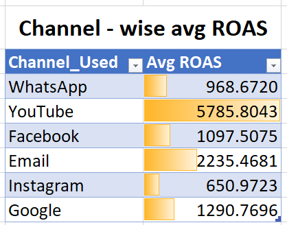
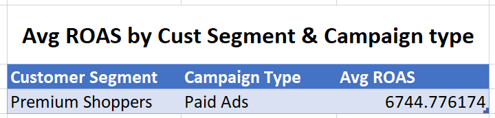
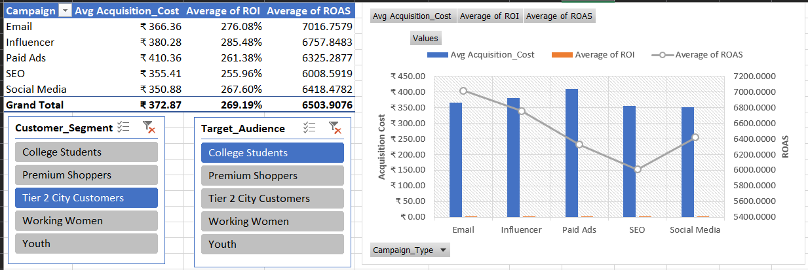
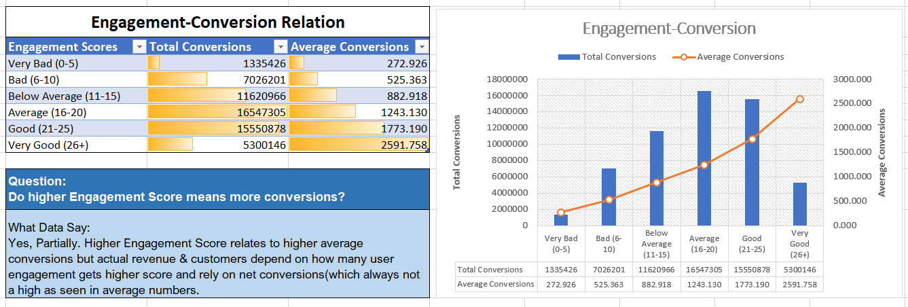
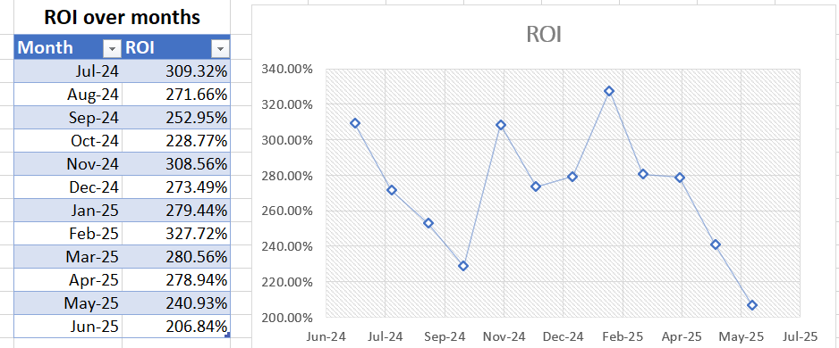
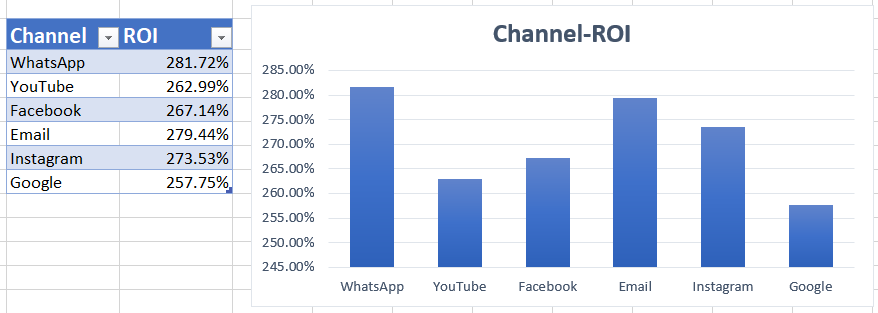

# Nykaa Marketing Campaign Analysis (Excel)

Excel-based analysis of 55,000+ marketing campaigns to evaluate channel, campaign type, and engagement performance using advanced formulas, Excel Tables, and pivot-style summaries.

**File:** `Marketing_Campaign.xlsx`
**Tools:** Excel (Tables, SUMIFS/AVERAGEIFS, INDEX-MATCH, PivotTables, Charts)
**Data:** Kaggle-style synthetic marketing campaign dataset (Campaign ID, Channel, Revenue, ROI, Engagement Score, etc.)

---

## Dataset

Raw data lives in `Campaign_Dataset` as an Excel Table (`Table1`), with calculated columns added alongside the source fields:

| Metric | Formula |
|---|---|
| CTR | `=Clicks/Impressions` |
| Lead Conversion Rate | `=Conversions/Leads` |
| CPA | `=Acquisition_Cost/Conversions` |
| Revenue per Conversion | `=Revenue/Conversions` |
| ROAS | `=Revenue/Acquisition_Cost` |
| Profit | `=Revenue-Acquisition_Cost` |
| Profit Margin | `=Profit/Revenue` |

All written as structured Table references (e.g. `Table1[[#This Row],[Clicks]]`) so they auto-fill for every new row.

---

## Analysis & Insights

### 1. Channel-wise Average ROAS
`=AVERAGE(INDEX(Campaign_Dataset!Q:Q,MATCH(Channel,Campaign_Dataset!E:E,0)))`

*Insight:* _Which channel delivers the best average Return on AD Spend, and why that matters for budget allocation._

---

### 2. Avg ROAS by Customer Segment & Campaign type
`=AVERAGEIFS(Campaign_Dataset!Q:Q, Campaign_Dataset!V:V,Customer Segment,Campaign_Dataset!B:B,Campaign type)`
`Dropdown list view for each option selection`

*Insight:* _Calculating average ROAS by selecting customer segment and campaign type using dropdown menu._

---

### 3. Campaign Type Summary (PivotTable)
Avg Acquisition Cost, Avg ROI, Avg ROAS per campaign type.

*Insight:* _Cost-efficiency comparison across campaign types — flags where spend is high but returns are low._

---

### 4. Engagement Score vs Conversions
`=SUMIFS(Table1[Conversions], Table1[Engagement_Score], "<=5")`

`=AVERAGEIFS(Table1[Conversions], Table1[Engagement_Score], ">5", Table1[Engagement_Score], "<=10")`

*Insight:* _Whether higher engagement actually predicts more conversions, or is just a vanity metric._

---

### 5. ROI Trend Over Time
`=AVERAGEIFS(Table1[ROI], Table1[Date], Month)`

*Insight:* _Monthly patterns in campaign performance — helps time future campaigns._

---

### 6. Channel-wise ROI
`=AVERAGEIF(Table1[Channel_Used], Channel, Table1[ROI])`

---
